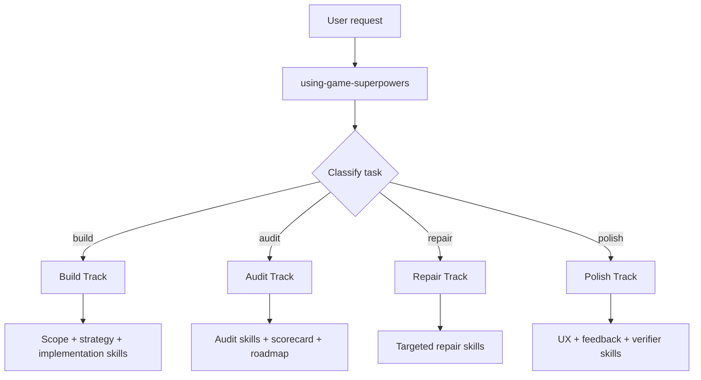
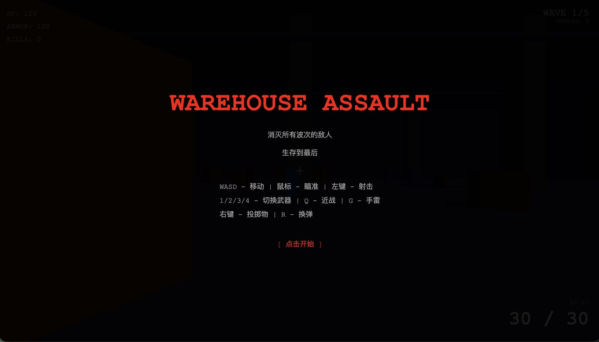
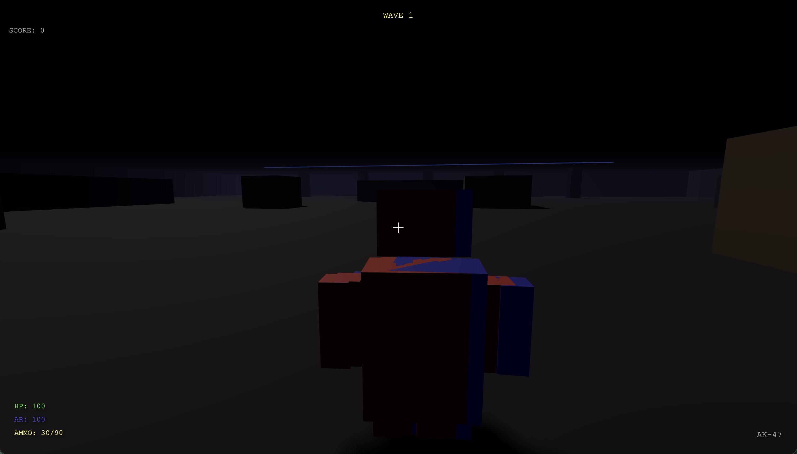

# Game Superpowers

[简体中文](./README.zh-CN.md)

An open **skills-first** game development system for Claude Code and Codex.

Game Superpowers is not a game engine and not a plugin-first product. It is a curated library of reusable **Agent Skills** for building, auditing, polishing, and productionizing game projects.

The design goal is simple:

> With the same model and the same prompt, Game Superpowers should help the agent produce a better game result by routing work through the right game-specific skills.

## Why skills-first

We are intentionally shipping this project as **skills**, not plugins.

Why:
- skills are the core reusable workflow unit in both Claude Code and Codex
- Claude Code supports project and personal skills directly
- Codex supports repository and user skills directly
- skills are easier to fork, audit, remix, and contribute to than plugin wrappers
- this project’s real value lives in the workflow logic, not in marketplace packaging

For Codex, skills are the authoring format and plugins are the installable distribution unit. For Claude Code, skills can live in personal, project, or plugin scopes. This repository chooses the **skills layer** as the source of truth. See `INSTALL.md` for the exact setup patterns.

## What this repository contains

- `skills/` — the full Game Superpowers skills library
- `schemas/` — shared structured output schemas
- `shared/` — templates, references, checklists, and examples
- `.claude/skills/` — compatibility symlinks that point back to `skills/` for Claude Code discovery
- `.agents/skills/` — compatibility symlinks that point back to `skills/` for Codex discovery
- `scripts/` — installers and validation helpers

Important:
- `skills/` is the only source of truth
- `.claude/skills/` and `.agents/skills/` do not contain a second copy of the library
- if you are browsing this repo on a platform that does not handle symlinks well, read `skills/` first

## Core idea

Game Superpowers has two main tracks:

### Build Track
For greenfield work, large features, prototypes, vertical slices, and AI-native development.

### Audit Track
For existing projects, UI/UX review, feedback review, architecture review, completeness review, and live-risk diagnosis.

The library is deliberately **game-native** rather than framework-native. It talks in terms such as:
- fantasy
- scope
- UX flow
- HUD readability
- feedback design
- game feel
- mechanics clarity
- production readiness
- live risk

instead of only talking in raw renderer or frontend framework terms.

## Skill library

The collection currently includes:
- bootstrap and routing skills
- build planning and strategy skills
- UX / UI / feedback skills
- mechanics and systems skills
- production and live patch skills
- audit and scorecard skills
- browser specialist skills for 2D and 3D web work

Use `using-game-superpowers` as the collection bootstrap skill, or invoke the specialized skills directly.

## How the collection works



## Case Study

This repository is meant to improve the very first outcome, not only the polished second pass.

In the case study below, both runs used:

- OpenCode
- the same model: `MiniMax-M2.7-highspeed`
- the same general FPS task

The key difference was whether the request used `/using-game-superpowers`.

### Same Model, Same Task, First-Prompt Difference

<table>
  <tr>
    <td><strong>Without Game Superpowers</strong></td>
    <td><strong>With Game Superpowers</strong></td>
  </tr>
  <tr>
    <td></td>
    <td></td>
  </tr>
</table>

> Both outputs came from the first prompt. This is the standard we care about most.

| Aspect | Without Game Superpowers | With Game Superpowers |
| --- | --- | --- |
| First-prompt result | Not reliably playable in this run | Playable first-person shooter result |
| Language consistency | Mixed language UI / instructions | Consistent English UI / instructions |
| Interaction quality | Weak start flow and low-confidence feedback | Clear start flow, better UI, feedback, and sound |
| Presentation | Rough blockout feel | Stronger art direction and clearer game framing |

### What is included

- prompt screenshots
- result screenshots
- downloadable single-file HTML outputs
- an explicit same-model comparison setup

See the full write-up and downloadable artifacts in [`docs/case-studies/one-prompt-fps.md`](./docs/case-studies/one-prompt-fps.md).

### Community Benchmarks Wanted

If you want to pressure-test this repository, do not just read the prompts. Run your own same-task comparisons.

We especially want more examples that compare:

- raw model output vs Game Superpowers
- different models on the same task
- Game Superpowers vs other game-focused agent workflows

Benchmark contribution guidelines live in [`docs/community-benchmarks.md`](./docs/community-benchmarks.md).

## Installation

See [`INSTALL.md`](./INSTALL.md) for the full instructions.
See [`CONTRIBUTING.md`](./CONTRIBUTING.md) for contribution rules and local validation.
See [`CODE_OF_CONDUCT.md`](./CODE_OF_CONDUCT.md) for collaboration expectations.

### Claude Code
Recommended options:
1. **Project / additional-directory mode**: use this repository as a skills source with `claude --add-dir /path/to/game-superpowers`
2. **Personal install**: symlink all skills into `~/.claude/skills/` with the install script

Notes:
- the install script creates symlinks, not copied folders
- if you downloaded the repository as a ZIP or your environment does not support symlinks cleanly, use the `skills/` directory as the source of truth and follow the fallback notes in `INSTALL.md`

### Codex
Recommended options:
1. **User install**: symlink this repository’s skills into `~/.agents/skills/`
2. **Repo-scoped install**: copy or symlink selected skills into a project’s `.agents/skills/`

Notes:
- the Codex install script creates a `game-superpowers` package root under `~/.agents/skills/` and links in the repo’s skill folders plus `shared/` and `schemas/`
- if that symlink model is confusing, treat `skills/` as the real library and `.agents/skills/` as a compatibility path only

## Typical usage

### Explicit collection entrypoint
- Claude: `/using-game-superpowers`
- Codex: `$using-game-superpowers`

### Example prompts
- “Use Game Superpowers to audit this existing game project’s UI/UX and feedback design.”
- “Use Game Superpowers to build a polished 2D web prototype with strong HUD and feedback.”
- “Use Game Superpowers to review whether this game is closer to first-playable or production-feature quality.”

## Why this is not a plugin repo

This project may still be packaged as plugins in downstream distributions, but this repository is intentionally **skills-first**:
- easier to understand
- easier to fork
- easier to review in Git
- easier to install locally during development
- easier to remix into project-specific AI workflows

## Open-source status

This repository is meant to be open and hackable.

The main artifacts to review are:
- `skills/using-game-superpowers/SKILL.md`
- `skills/game-super-build/SKILL.md`
- `skills/game-project-audit/SKILL.md`
- `skills/game-ux-flow-audit/SKILL.md`
- `skills/game-feedback-design/SKILL.md`

Before opening a pull request, run:

```bash
python3 scripts/validate_skills.py
```

## Versioning

This documentation set reflects the **skills-only** distribution direction.

## License

MIT
