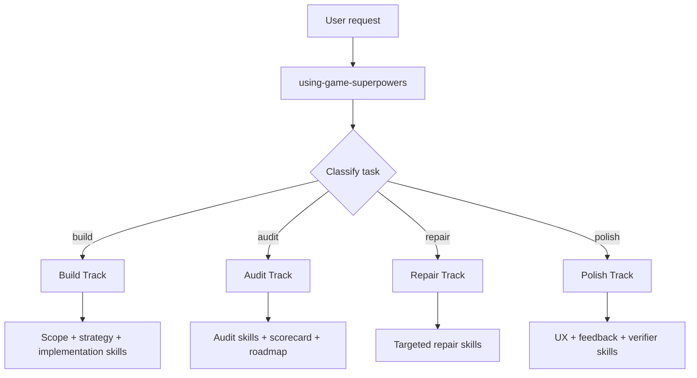

# Game Superpowers

[简体中文](./README.zh-CN.md)

Game development skills for Claude Code and Codex.

- build, audit, polish, and repair game projects
- game-native workflow routing instead of generic coding prompts
- reusable skills under `skills/`

## Install

Full setup instructions live in [`INSTALL.md`](./INSTALL.md).

### Claude Code

Recommended:

1. Project / additional-directory mode

```bash
claude --add-dir /path/to/game-superpowers-skills-only
```

2. Personal install

```bash
bash scripts/install-claude-skills.sh
```

### Codex

Recommended:

1. User install

```bash
bash scripts/install-codex-skills.sh
```

2. Repo-scoped install

Copy or symlink selected skills into a project's `.agents/skills/`.

## Use

### Collection entrypoint

- Claude: `/using-game-superpowers`
- Codex: `$using-game-superpowers`

### Example prompts

- "Use Game Superpowers to audit this existing game project's UI/UX and feedback design."
- "Use Game Superpowers to build a polished 2D web prototype with strong HUD and feedback."
- "Use Game Superpowers to review whether this game is closer to first-playable or production-feature quality."

## Tracks



Case study: [`docs/case-studies/one-prompt-fps.md`](./docs/case-studies/one-prompt-fps.md)

## What's in this repo

- `skills/` — the full Game Superpowers skill library
- `schemas/` — shared structured output schemas
- `shared/` — templates, references, checklists, and examples
- `.claude/skills/` — Claude Code discovery symlinks pointing back to `skills/`
- `.agents/skills/` — Codex discovery symlinks pointing back to `skills/`
- `scripts/` — installers and validation helpers

Important:

- `skills/` is the only source of truth
- `.claude/skills/` and `.agents/skills/` are compatibility paths, not a second copy of the library
- if your platform or archive tool handles symlinks poorly, inspect `skills/` first

## Includes

The collection currently includes:

- bootstrap and routing skills
- build planning and strategy skills
- UX, UI, and feedback skills
- mechanics and systems skills
- production and live patch skills
- audit and scorecard skills
- browser specialist skills for 2D and 3D web work

## Contributing

Suggested starting points:

- `skills/using-game-superpowers/SKILL.md`
- `skills/game-super-build/SKILL.md`
- `skills/game-project-audit/SKILL.md`
- `skills/game-ux-flow-audit/SKILL.md`
- `skills/game-feedback-design/SKILL.md`

Before opening a pull request, run:

```bash
python3 scripts/validate_skills.py
```

See [`CONTRIBUTING.md`](./CONTRIBUTING.md) for contribution rules and local validation.
See [`CODE_OF_CONDUCT.md`](./CODE_OF_CONDUCT.md) for collaboration expectations.

## License

MIT
