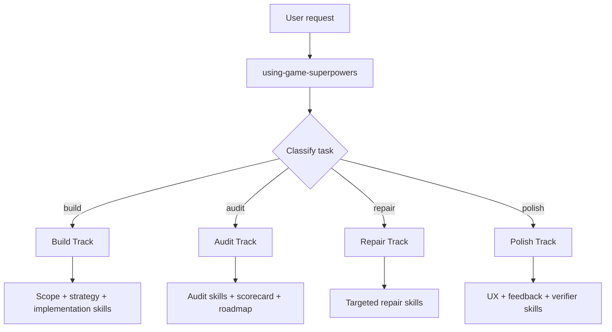

# Game Superpowers

[简体中文](./README.zh-CN.md)

Game development skills for Claude Code and Codex.

Build, audit, polish, and repair game projects with reusable game-native skills.

## At a glance

- for Claude Code and Codex
- skills live in `skills/`
- install locally, fork freely, use selectively
- source of truth stays in this repo

## Quickstart

### Claude

Use the whole repo:

```bash
claude --add-dir /path/to/game-superpowers-skills-only
```

Or install into your personal skills:

```bash
bash scripts/install-claude-skills.sh
```

```powershell
powershell -ExecutionPolicy Bypass -File scripts/install-claude-skills.ps1
```

This installs symlinks into `~/.claude/skills/` and sets up repo-local git hooks so later `git pull` and branch switches refresh those links automatically.

### Codex

Install into your user skills:

```bash
bash scripts/install-codex-skills.sh
```

```powershell
powershell -ExecutionPolicy Bypass -File scripts/install-codex-skills.ps1
```

This installs the `~/.agents/skills/game-superpowers/` package root and sets up the same auto-sync hooks for future pulls and checkouts.

Or copy or symlink selected skills into a project's `.agents/skills/`.

Full setup instructions: [`INSTALL.md`](./INSTALL.md)

### Updates after install

- edits to existing skills apply immediately because the installed entries are symlinks back to this repo
- added, renamed, or removed skills refresh automatically after `git pull` and branch switches
- if you want to force a refresh manually, run `bash scripts/sync-all-skills.sh`
- on Windows, use `powershell -ExecutionPolicy Bypass -File scripts/sync-all-skills.ps1`

## Use

### Entrypoint

- Claude: `/using-game-superpowers`
- Codex: `$using-game-superpowers`

### Example prompts

- "Use Game Superpowers to audit this existing game project's UI/UX and feedback design."
- "Use Game Superpowers to build a polished 2D web prototype with strong HUD and feedback."
- "Use Game Superpowers to review whether this game is closer to first-playable or production-feature quality."

## Tracks



## Repo Layout

- `skills/` — the full Game Superpowers skill library
- `schemas/` — shared structured output schemas
- `shared/` — templates, references, checklists, and examples
- `.claude/skills/` — Claude Code discovery symlinks pointing back to `skills/`
- `.agents/skills/` — Codex discovery symlinks pointing back to `skills/`
- `scripts/` — installers, auto-sync hooks, and validation helpers

Notes:

- `skills/` is the only source of truth
- `.claude/skills/` and `.agents/skills/` are compatibility paths, not a second copy of the library
- if your platform or archive tool handles symlinks poorly, inspect `skills/` first

## Library

- bootstrap and routing skills
- build planning and strategy skills
- UX, UI, and feedback skills
- mechanics and systems skills
- production and live patch skills
- audit and scorecard skills
- browser specialist skills for 2D and 3D web work

## Development

Read these first:

- `skills/using-game-superpowers/SKILL.md`
- `skills/game-super-build/SKILL.md`
- `skills/game-project-audit/SKILL.md`
- `skills/game-ux-flow-audit/SKILL.md`
- `skills/game-feedback-design/SKILL.md`

Before opening a pull request, run:

```bash
python3 scripts/validate_skills.py
```

See [`CONTRIBUTING.md`](./CONTRIBUTING.md) for repository change rules and local validation.
See [`CODE_OF_CONDUCT.md`](./CODE_OF_CONDUCT.md) for collaboration expectations.

## License

MIT
