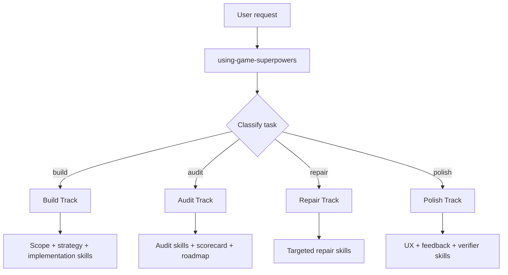

# Game Superpowers

[English](./README.md)

一个给 Claude Code 和 Codex 用的游戏开发 skills 库。

用可复用的 game-native skills 来 build、audit、polish、repair 游戏项目。

## 一眼看完

- 给 Claude Code 和 Codex 用
- skills 全部放在 `skills/`
- 可以本地安装、自由 fork、按需组合

## Quickstart

### Claude

整个仓库直接接入：

```bash
claude --add-dir /path/to/game-superpowers-skills-only
```

或者装到个人 skills：

```bash
bash scripts/install-claude-skills.sh
```

### Codex

装到用户 skills：

```bash
bash scripts/install-codex-skills.sh
```

或者把需要的 skills 复制或 symlink 到项目的 `.agents/skills/`。

完整安装说明见 [`INSTALL.md`](./INSTALL.md)。

## 使用

### 入口

- Claude：`/using-game-superpowers`
- Codex：`$using-game-superpowers`

### 示例 prompt

- “Use Game Superpowers to audit this existing game project's UI/UX and feedback design.”
- “Use Game Superpowers to build a polished 2D web prototype with strong HUD and feedback.”
- “Use Game Superpowers to review whether this game is closer to first-playable or production-feature quality.”

## 轨道



案例：[`docs/case-studies/one-prompt-fps.md`](./docs/case-studies/one-prompt-fps.md)

## Repo Layout

- `skills/`：完整的 Game Superpowers skills 库
- `schemas/`：共享的结构化输出 schema
- `shared/`：模板、参考资料、检查表、示例
- `.claude/skills/`：供 Claude Code 发现的兼容 symlink，实际指回 `skills/`
- `.agents/skills/`：供 Codex 发现的兼容 symlink，实际指回 `skills/`
- `scripts/`：安装脚本和校验脚本

- `skills/` 是唯一的 source of truth
- `.claude/skills/` 和 `.agents/skills/` 只是兼容路径，不是第二份内容副本
- 如果你的平台或压缩工具对 symlink 支持不好，请优先查看 `skills/`

## 包含内容

- bootstrap 和 routing skills
- build planning 和 strategy skills
- UX、UI、feedback skills
- mechanics 和 systems skills
- production 和 live patch skills
- audit 和 scorecard skills
- 面向 2D / 3D web 游戏工作的 browser specialist skills

## 开发

先看这些：

- `skills/using-game-superpowers/SKILL.md`
- `skills/game-super-build/SKILL.md`
- `skills/game-project-audit/SKILL.md`
- `skills/game-ux-flow-audit/SKILL.md`
- `skills/game-feedback-design/SKILL.md`

提交 PR 前，建议先运行：

```bash
python3 scripts/validate_skills.py
```

贡献规则见 [`CONTRIBUTING.md`](./CONTRIBUTING.md)。
协作行为准则见 [`CODE_OF_CONDUCT.md`](./CODE_OF_CONDUCT.md)。

## License

MIT
