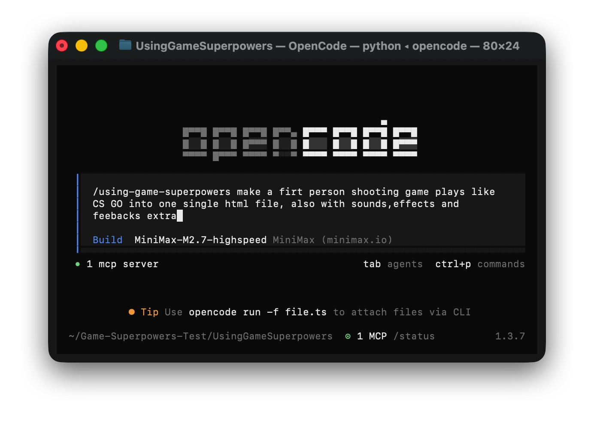
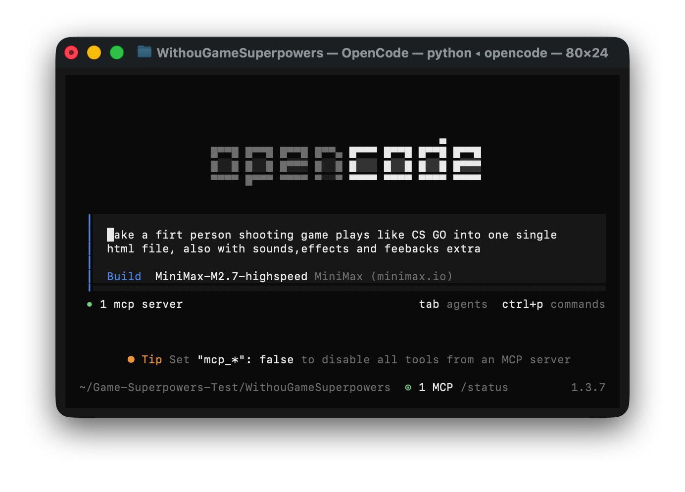
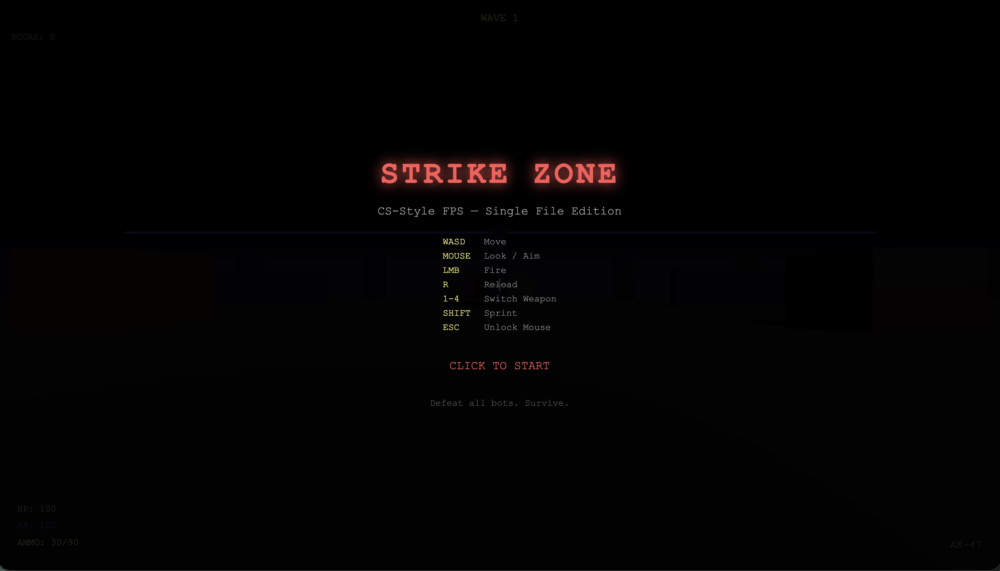

# One-Prompt FPS Case Study

This is an illustrative repository case study, not a formal benchmark.

The goal was simple:

> See how much difference Game Superpowers can make on the very first prompt.

## Test setup

- Runtime: OpenCode
- Model: `MiniMax-M2.7-highspeed`
- Task: build a Counter-Strike-style single-file browser FPS with sound, effects, and feedback
- Intentional difference:
  - baseline run used the raw prompt directly
  - assisted run prefixed the task with `/using-game-superpowers`

## Prompt screenshots

### With Game Superpowers

### Without Game Superpowers

## Output comparison

### Baseline output

### Game Superpowers output

## What changed in this run

| Aspect | Without Game Superpowers | With Game Superpowers |
| --- | --- | --- |
| First-prompt result | Rough output that was not reliably playable in this run | A game that could start, render, and be played |
| Language consistency | UI and instructions showed a language mismatch | UI and instructions stayed consistent in English |
| Start flow | Weak onboarding and unclear first interaction | Clear title screen and click-to-start flow |
| Gameplay loop | Did not land as a usable first playable | Included a playable FPS loop with visible enemy interaction |
| UI / HUD | Minimal, low-confidence presentation | Clear HUD, title screen, weapon state, and game framing |
| Feedback | Limited or unclear feedback in this run | Better feedback, including sound effects and reward / hit acknowledgment |
| Visual quality | Rough blockout feel | Stronger visual direction and clearer game presentation |

## Artifacts

- [With Game Superpowers HTML](../../examples/one-prompt-fps/with-game-superpowers.html)
- [Without Game Superpowers HTML](../../examples/one-prompt-fps/without-game-superpowers.html)

## Reading this example correctly

This example is meant to show repository intent:

- same model
- same general task
- first-prompt outcome difference

It is not meant to claim that every task will improve by exactly this amount, or that this is a statistically rigorous benchmark.
